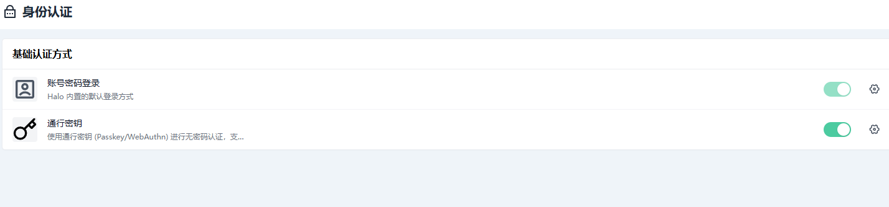
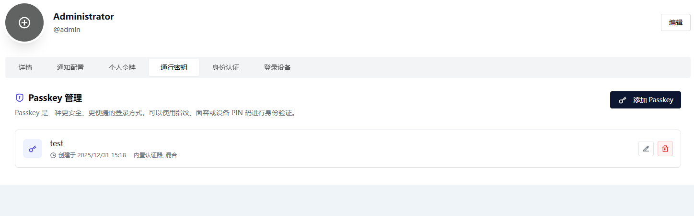
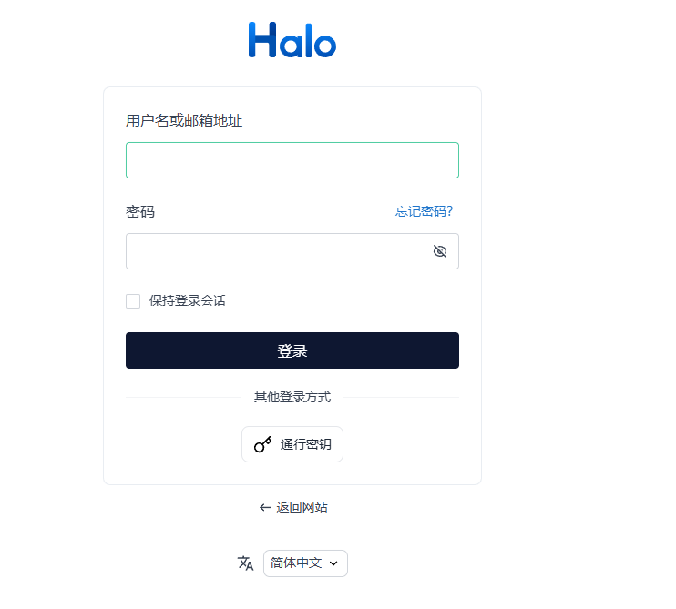
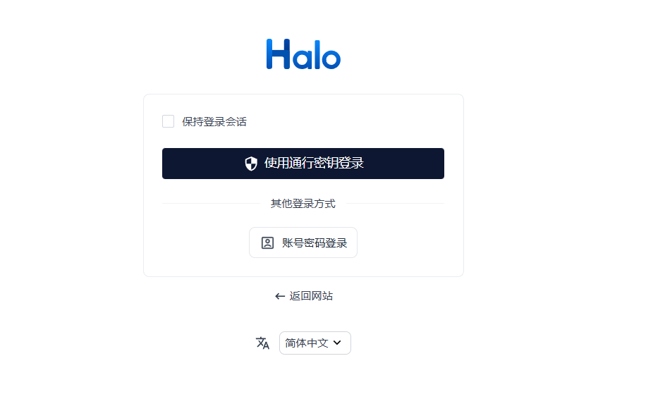

# Passkey 认证插件

<p align="center">
  
</p>

<p align="center">
  为 Halo 提供 Passkey (WebAuthn) 无密码认证支持
</p>

<p align="center">
  <a href="https://github.com/ilay1678/halo-plugin-auth-passkey/releases"></a>
  <a href="https://www.halo.run"></a>
  <a href="./LICENSE"></a>
</p>

---

## 📖 简介

Passkey 是下一代无密码认证技术，基于 FIDO2/WebAuthn 标准。本插件让 Halo 用户能够使用指纹、面部识别或设备 PIN 码进行安全登录，告别传统密码。

### ✨ 功能特性

- 🔐 **无密码登录** - 使用 Passkey 进行安全的无密码登录
- 📱 **多设备支持** - 支持绑定多个 Passkey 设备
- 🖥️ **跨平台兼容** - 支持 Windows Hello、Touch ID、Face ID、Android 指纹等
- 🔒 **安全可靠** - 基于 WebAuthn 标准，使用公钥加密技术，抵御钓鱼攻击
- ☁️ **云同步支持** - 支持 iCloud Keychain、Google Password Manager 等同步的 Passkey
- 🎨 **用户友好** - 在用户中心提供直观的 Passkey 管理界面

## 📸 截图预览

### 启用认证方式

在后台"身份认证"设置中启用通行密钥认证：



### Passkey 管理

在用户中心的"通行密钥"选项卡添加和管理 Passkey：



### 登录页面

用户可以在登录页面选择使用通行密钥登录：



### 通行密钥登录

点击后进入通行密钥认证页面：



## 📋 系统要求

| 要求 | 版本 |
|------|------|
| Halo | 2.22.0+ |
| Java | 21+ |
| 浏览器 | Chrome 67+、Firefox 60+、Safari 13+、Edge 79+ |

> ⚠️ **注意**：Passkey 需要在 HTTPS 环境下使用（localhost 开发环境除外）

## 📦 安装

### 方式一：应用市场安装（推荐）

1. 进入 Halo 后台 → 插件管理 → 应用市场
2. 搜索 "Passkey" 或 "无密码认证"
3. 点击安装并启用

### 方式二：手动安装

1. 从 [Releases](https://github.com/ilay1678/halo-plugin-auth-passkey/releases) 下载最新版本的 JAR 文件
2. 进入 Halo 后台 → 插件管理 → 安装插件
3. 上传下载的 JAR 文件
4. 启用插件

## 🚀 使用指南

### 绑定 Passkey

1. 登录 Halo 后台
2. 点击右上角头像 → 个人中心
3. 选择 "Passkey" 选项卡
4. 点击 "添加 Passkey" 按钮
5. 按照浏览器提示完成验证（指纹/面容/PIN）
6. 为您的 Passkey 设置一个易于识别的名称

### 使用 Passkey 登录

1. 在登录页面点击 "Passkey 登录" 按钮
2. 选择要使用的 Passkey
3. 完成验证（指纹/面容/PIN）
4. 自动登录成功

### 管理 Passkey

在用户中心的 Passkey 选项卡中，您可以：

- 📋 查看已绑定的所有 Passkey
- ✏️ 修改 Passkey 名称
- 🗑️ 删除不再使用的 Passkey
- 📊 查看最后使用时间

## 🔧 API 文档

所有 API 端点的基础路径为：`/apis/api.passkey.halo.run/v1alpha1`

### 注册 Passkey（需要登录）

#### 获取注册选项

```http
POST /registration/options
Content-Type: application/json

{
  "displayName": "My MacBook"  // 可选
}
```

**响应示例：**

```json
{
  "challenge": "base64url-encoded-challenge",
  "rp": {
    "id": "example.com",
    "name": "Halo"
  },
  "user": {
    "id": "base64url-encoded-user-id",
    "name": "admin",
    "displayName": "Admin"
  },
  "pubKeyCredParams": [
    { "type": "public-key", "alg": -7 },
    { "type": "public-key", "alg": -257 }
  ],
  "timeout": 60000,
  "authenticatorSelection": {
    "residentKey": "preferred",
    "userVerification": "preferred"
  },
  "excludeCredentials": []
}
```

#### 验证注册

```http
POST /registration/verify
Content-Type: application/json

{
  "credentialId": "base64url-encoded-credential-id",
  "attestationObject": "base64url-encoded-attestation-object",
  "clientDataJSON": "base64url-encoded-client-data",
  "transports": ["internal", "hybrid"],
  "displayName": "My MacBook"
}
```

### 认证登录（公开）

#### 获取认证选项

```http
POST /authentication/options
Content-Type: application/json

{
  "username": "admin"  // 可选，不填则允许选择任意已注册的 Passkey
}
```

#### 验证认证

```http
POST /authentication/verify
Content-Type: application/json

{
  "sessionId": "session-id-from-options",
  "credentialId": "base64url-encoded-credential-id",
  "authenticatorData": "base64url-encoded-authenticator-data",
  "clientDataJSON": "base64url-encoded-client-data",
  "signature": "base64url-encoded-signature",
  "userHandle": "base64url-encoded-user-handle"
}
```

### 凭证管理（需要登录）

#### 获取凭证列表

```http
GET /credentials
```

**响应示例：**

```json
{
  "credentials": [
    {
      "name": "passkey-abc123",
      "credentialId": "base64url-encoded-id",
      "displayName": "MacBook Touch ID",
      "createdAt": "2024-01-01T00:00:00Z",
      "lastUsedAt": "2024-01-15T12:30:00Z",
      "backedUp": true,
      "transports": ["internal"]
    }
  ]
}
```

#### 更新凭证

```http
PUT /credentials/{name}
Content-Type: application/json

{
  "displayName": "New Name"
}
```

#### 删除凭证

```http
DELETE /credentials/{name}
```

## 🛠️ 开发指南

### 环境准备

- JDK 21+
- Node.js 18+
- pnpm 8+

### 克隆项目

```bash
git clone https://github.com/ilay1678/halo-plugin-auth-passkey.git
cd halo-plugin-auth-passkey
```

### 安装依赖

```bash
# 安装前端依赖
cd ui
pnpm install
cd ..
```

### 开发模式

```bash
# 启动 Halo 开发服务器（包含热重载）
./gradlew haloServer

# 在另一个终端启动前端开发
cd ui
pnpm dev
```

### 构建插件

```bash
./gradlew build
```

构建完成后，插件 JAR 文件位于 `build/libs/` 目录。

### 项目结构

```
plugin-auth-passkey/
├── src/main/java/top/ilay/authpasskey/
│   ├── AuthPasskeyPlugin.java         # 插件主类
│   ├── PasskeyCredential.java         # 凭证数据模型
│   ├── PasskeyCredentialService.java  # 凭证服务
│   ├── PasskeyEndpoint.java           # REST API 端点
│   ├── PasskeyConfiguration.java      # Spring 配置
│   └── WebAuthnService.java           # WebAuthn 核心服务
├── src/main/resources/
│   ├── plugin.yaml                    # 插件配置
│   ├── extensions/
│   │   ├── auth-provider.yaml         # 认证提供者配置
│   │   ├── reverseproxy.yaml          # 静态资源代理配置
│   │   └── role.yaml                  # 角色权限配置
│   ├── templates/
│   │   └── login_passkey.html         # 通行密钥登录页面
│   └── static/
│       └── passkey.svg                # 通行密钥图标
├── ui/                                # 前端模块
│   └── src/
│       ├── index.ts                   # 插件入口
│       ├── components/
│       │   └── PasskeyList.vue        # Passkey 管理组件
│       ├── composables/
│       │   └── usePasskey.ts          # WebAuthn API 封装
│       └── types/
│           └── index.ts               # TypeScript 类型
└── build.gradle                       # Gradle 构建配置
```

## ❓ 常见问题

### Q: 为什么提示"不支持 Passkey"？

A: 请确保：
1. 使用支持 WebAuthn 的现代浏览器
2. 网站使用 HTTPS（localhost 除外）
3. 设备有可用的认证器（指纹传感器、面容识别等）

### Q: Passkey 可以在多个设备上使用吗？

A: 可以。您可以：
1. 在每个设备上分别注册 Passkey
2. 使用支持同步的 Passkey（如 iCloud Keychain、Google Password Manager）

### Q: 忘记密码后还能用 Passkey 登录吗？

A: 可以。Passkey 是独立于密码的认证方式，只要您有已注册的 Passkey 设备就能登录。

### Q: 如何在新设备上使用 Passkey？

A: 有两种方式：
1. 使用已同步的 Passkey（需要云服务支持）
2. 先用密码登录，然后在新设备上注册新的 Passkey

## 🤝 贡献

欢迎提交 Issue 和 Pull Request！

1. Fork 本仓库
2. 创建功能分支 (`git checkout -b feature/amazing-feature`)
3. 提交更改 (`git commit -m 'Add some amazing feature'`)
4. 推送到分支 (`git push origin feature/amazing-feature`)
5. 打开 Pull Request

## 📄 许可证

本项目采用 [GPL-3.0](./LICENSE) 许可证。

## 🔗 相关链接

- [Halo 官网](https://www.halo.run)
- [Halo 插件开发文档](https://docs.halo.run/category/%E6%8F%92%E4%BB%B6%E5%BC%80%E5%8F%91)
- [WebAuthn 规范](https://www.w3.org/TR/webauthn-2/)
- [Passkeys.io](https://passkeys.io) - 了解更多关于 Passkey 的信息
